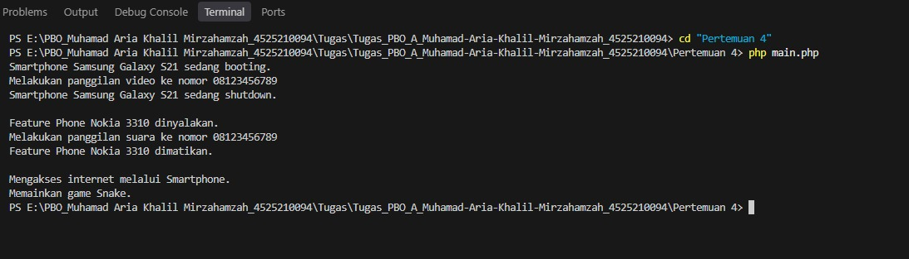

# Tugas Pemrograman Berorientasi Objek (PBO) - PHP

| | |
|---|---|
| **Nama** | Muhamad Aria Khalil Mirzahamzah |
| **NIM** | 4525210094 |
| **Kelas** | PBO A |
| **Semester** | 3 |
| **Bahasa** | PHP 8+ |


## Pertemuan 4 - Polimorfisme

**Materi:** polimorfisme, overriding, instanceof

**Cara menjalankan:**

```powershell
cd "Pertemuan 4"
php Main.php
```

**Hasil output:**



---

## Pertemuan 5 - Asosiasi, Agregasi, dan Komposisi

**Materi:** relasi antar class (Dokter-Pasien, Tim-Pemain, Buku-Bab)

**Cara menjalankan:**

```powershell
cd "Pertemuan 5"
php Main.php
```

**Hasil output:**


---

## Pertemuan 6 - Abstract Class dan Interface

**Materi:** abstract class, interface, trait (pengganti default method)

**Cara menjalankan:**

```powershell
cd "Pertemuan 6"
php Main.php
```

**Hasil output:**


---

## Troubleshooting

| Masalah | Solusi |
|---|---|
| `php is not recognized` | PHP belum terpasang atau belum masuk PATH. Install PHP, lalu tutup dan buka ulang terminal. |
| `Could not open input file` | Kamu belum berada di folder yang berisi file tersebut. Cek dengan `dir`. |
| `Class not found` | File class belum ada di folder yang sama, atau nama file di `require_once` tidak cocok. |
| Gambar tidak muncul di README | Pastikan file ada di folder `screenshots/` dan namanya sama persis dengan yang ditulis di README. |

## Catatan

- Folder `screenshots/` berisi tangkapan layar hasil menjalankan tiap program.
- Perbedaan Java dan PHP yang perlu diperhatikan: PHP tidak mendukung overloading dan default method di interface, sehingga digantikan default parameter dan trait.